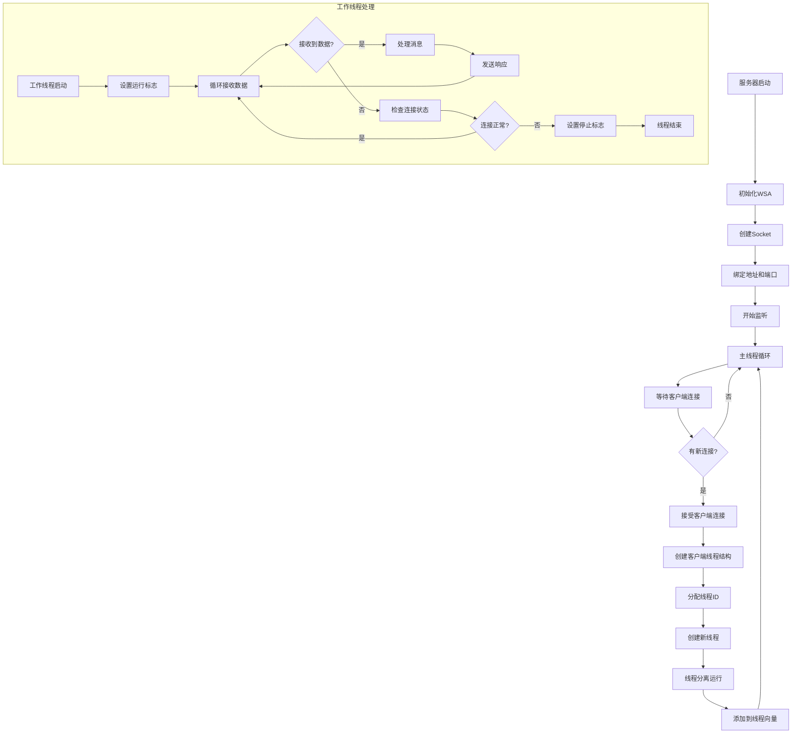
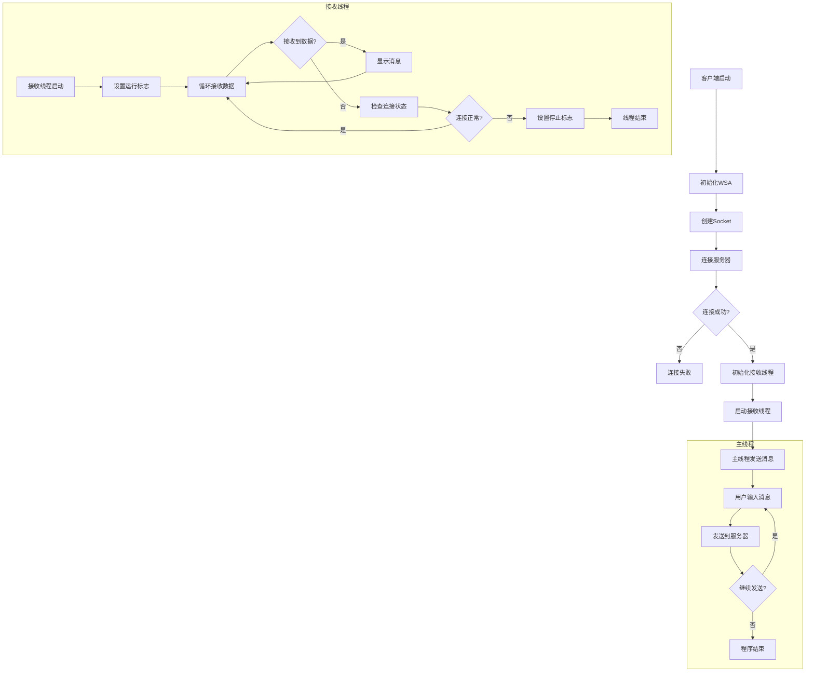
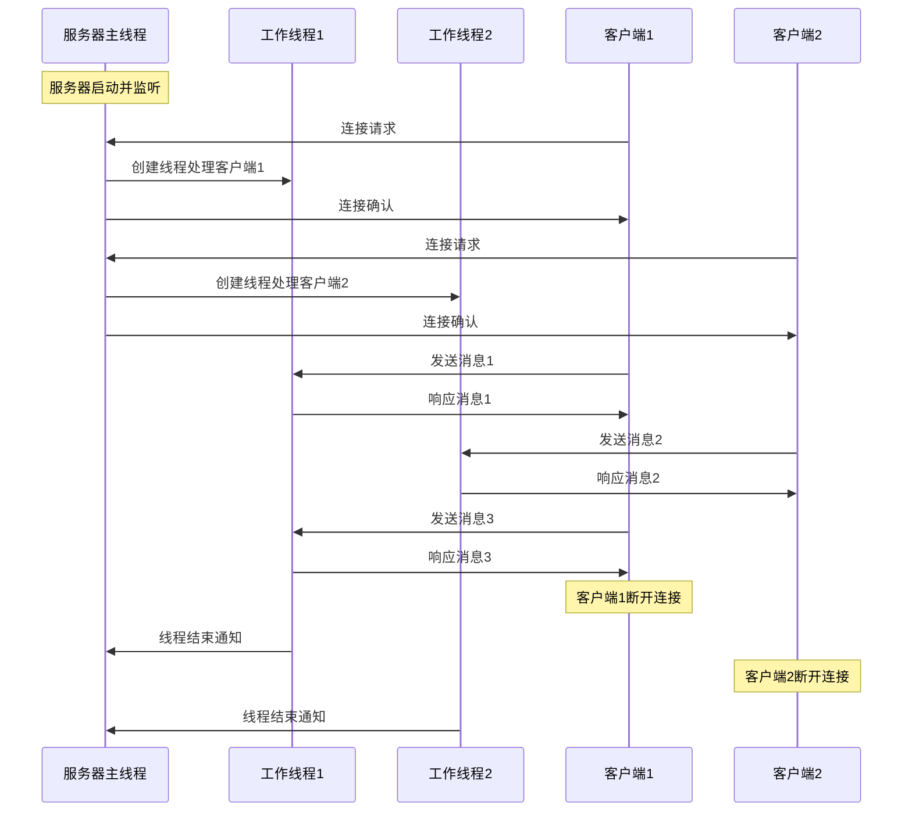
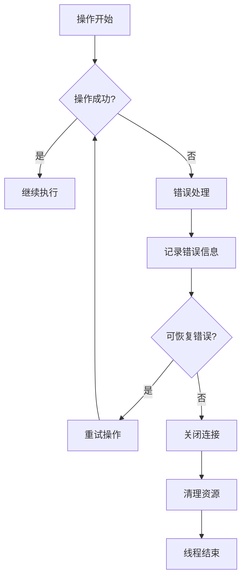

# 多线程Socket通讯流程图

## 整体架构图

```
┌─────────────────┐    ┌─────────────────┐    ┌─────────────────┐
│   客户端1        │    │   客户端2        │    │   客户端N        │
│                 │    │                 │    │                 │
│ ┌─────────────┐ │    │ ┌─────────────┐ │    │ ┌─────────────┐ │
│ │  主线程     │ │    │ │  主线程     │ │    │ │  主线程     │ │
│ │ (发送消息)  │ │    │ │ (发送消息)  │ │    │ │ (发送消息)  │ │
│ └─────────────┘ │    │ └─────────────┘ │    │ └─────────────┘ │
│ ┌─────────────┐ │    │ ┌─────────────┐ │    │ ┌─────────────┐ │
│ │ 接收线程    │ │    │ │ 接收线程    │ │    │ │ 接收线程    │ │
│ │ (接收消息)  │ │    │ │ (接收消息)  │ │    │ │ (接收消息)  │ │
│ └─────────────┘ │    │ └─────────────┘ │    │ └─────────────┘ │
└─────────────────┘    └─────────────────┘    └─────────────────┘
         │                       │                       │
         └───────────────────────┼───────────────────────┘
                                 │
                    ┌─────────────────┐
                    │    服务器        │
                    │                 │
                    │ ┌─────────────┐ │
                    │ │  主线程     │ │
                    │ │(接受连接)   │ │
                    │ └─────────────┘ │
                    │ ┌─────────────┐ │
                    │ │ 工作线程1   │ │
                    │ │(处理客户端1)│ │
                    │ └─────────────┘ │
                    │ ┌─────────────┐ │
                    │ │ 工作线程2   │ │
                    │ │(处理客户端2)│ │
                    │ └─────────────┘ │
                    │ ┌─────────────┐ │
                    │ │ 工作线程N   │ │
                    │ │(处理客户端N)│ │
                    │ └─────────────┘ │
                    └─────────────────┘
```

## 服务器端详细流程图



## 客户端详细流程图



## 多线程交互时序图



## 线程生命周期管理

### 服务器线程生命周期

```
线程创建 → 线程运行 → 线程结束
    ↓           ↓         ↓
分配资源    处理消息    释放资源
    ↓           ↓         ↓
添加到向量   循环接收    从向量移除
```

### 客户端线程生命周期

```
主线程启动 → 创建接收线程 → 主线程发送消息
    ↓              ↓              ↓
初始化Socket   接收线程运行    用户输入处理
    ↓              ↓              ↓
连接服务器    循环接收数据    发送到服务器
    ↓              ↓              ↓
连接成功      显示接收消息    程序结束
```

## 关键数据结构关系

```
SocketServerTest
├── m_nServerSocket (服务器Socket)
├── m_Vecthread (线程向量)
│   ├── Sthread[0]
│   │   ├── t1 (线程指针)
│   │   ├── isRuning (运行标志)
│   │   ├── threadID (线程ID)
│   │   └── csocket (客户端Socket)
│   ├── Sthread[1]
│   └── ...
└── m_CsocketCount (线程计数器)

MultipartiteClientSocketTest
├── m_nLocalSocket (客户端Socket)
├── m_message (消息缓冲区)
└── recvThread (接收线程)
    ├── t1 (线程指针)
    └── isRuning (运行标志)
```

## 错误处理流程



## 性能优化建议

1. **线程池管理**：避免频繁创建销毁线程
2. **缓冲区优化**：使用适当大小的接收缓冲区
3. **连接复用**：实现连接池机制
4. **异步I/O**：使用IOCP或epoll提高性能
5. **消息队列**：使用队列缓冲消息处理 